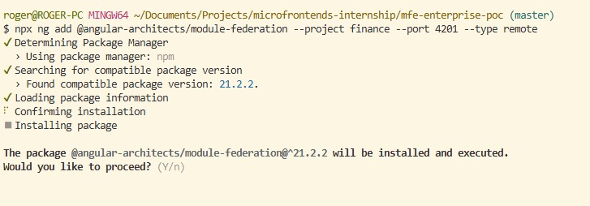
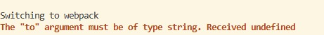
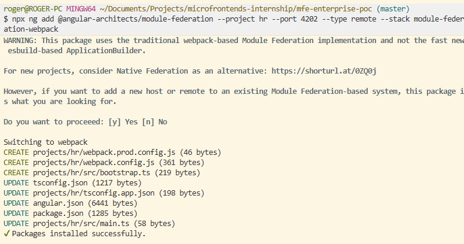

# Using module federation

When creating to be remote



Some difficulties, the webpack is made for angular older versions, so I get an error that the script cannot read well the new angular configs



After a more deep debugging, the issue was that the outputPath at angular.json didn't exist so gets a undefined error, also added a new flag for the script `--stack module-federation-webpack` that its required to point to the federation I wanna use.



Exposing the routes, at the webpack.config.js created by the script, like this allows the host to load the routes dynamically.

Adding host, using the same script but now with --type dynamic-host

Checking if all the configs are added right, manifest with the exposes from finance and hr.

## Felt unorganized

Created components and routing for better structure. At host and finance;

Encountered some problems with the configs, had to add some manually. The ts config at hr and finance were missing the paths for shared-ui that's why I added them manually. Also the first config from webpack create the slashes reversed at web pack config this bugs.

## Errors

After finishing the configurations got some errors

- Policy blocking the requests

I had to allow the 4201 and 4202 ports to permit the direct access from 4200.

- EnviromentInjector error

```(bash)

bootstrap.ts:5 ERROR RuntimeError: NG0203: The `EnvironmentInjector` token injection failed. `inject()` function must be called from an injection context such as a constructor, a factory function, a field initializer, or a function used with `runInInjectionContext`. Find more at https://v21.angular.dev/errors/NG0203

```

the sub-projects are packaged under a monorepo workspace, their local `package.json` files only contain execution scripts and do not declare dependencies.

Because of this, the `shareAll()` helper inside each local `webpack.config.js` was unable to locate or resolve the packages from the sub-project directories. This led to multiple independent copies of `@angular` bundles loading simultaneously, violating the singleton requirement and causing the `NG0203` environment injector runtime error.

I configure `shareAll()` to read the workspace root `package.json` instead.

```javascript
shared: {
  ...shareAll({ singleton: true, strictVersion: true, requiredVersion: 'auto' }, undefined,
    path.join(__dirname, '../../package.json')),
}
```
